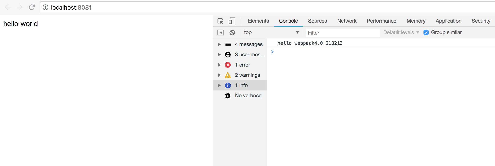

# 从零开始配置webpack4.0
node的安装和npm的安装咱们这里就不讲了主要讲的是webpack4.0<br>
webpack4.0的升级让更多的小白更加容易上手，易懂
我也是个小白。所以写了个小白教程。
```dash
npm init
```
然后一直enter按下去生成package.json文件
如果过不需要任何的设置直接使用
```
npm init -y
```
生成下面
```json
{
  "name": "createreact",
  "version": "1.0.0",
  "description": "",
  "main": "index.js",
  "scripts": {
    "test": "echo \"Error: no test specified\" && exit 1"
  },
  "author": "",
  "license": "ISC"
}
```

生成了package.json文件之后, 然后创建webapck.config.js文件。

```js
const path = require('path');

module.exports = {
  entry: path.resolve(__dirname,'./src/main.js'),  //入口文件 默认是./src/index.js 如果你不换文件夹可以不设置
  output: {
    path: path.resolve(__dirname, './dist'), //出口文件 默认是./dist 如果你不换文件夹可以不设置
    filename: 'build.js'
  }
};

```
配置好我们的入口文件之后在src文件下创建main.js

```js
const app = () => {
  console.log('hello webpack4.0');
}
app();
```
下载webpack 和webpack-cli
```
npm i webpack -D // -D === --save-dev 保存在开发环境 -S 保存在生成环境
npm i webpack-cli -D
```
这时候回到我们package.json 开始设置我们的命令<br>


```json
{
  "name": "createreact",
  "version": "1.0.0",
  "description": "",
  "main": "index.js",
  "scripts": {
    "test": "echo \"Error: no test specified\" && exit 1",
    "build": "webpack"
  },
  "author": "",
  "license": "ISC",
  "devDependencies": {
    "webpack": "^4.17.1",
    "webpack-cli": "^3.1.0"
  }
}

```
然后执行
```
npm run build
```
然后我们在看dist文件夹下生成一个叫build.js文件这就是webpack为我们打包好的JS文件。

那改如何编译html文件呢？
这时候我们就需要 html-webpack-plugin 这个插件了

```
npm i html-webpacl-plugin -D
```
安装完成后开始配置打包HTML

```js
const path = require('path');
const htmlWebpackPlugin = require('html-webpack-plugin');
module.exports = {
  entry: path.resolve(__dirname,'./src/main.js'),
  output: {
    path: path.resolve(__dirname, 'dist'),
    filename: 'build.js'
  },
  plugins: [
    new htmlWebpackPlugin(
      {
        filename: 'index.html', //打包后html的命名
        template: path.resolve(__dirname, './index.html') //打包的地址
      }
    )
  ]
};

```
这时候再去执行 啊
```
npm run build 
```
你会发现 dist目录下会增加了index.html
index.html会直接引入我们build.js。<br>
直接打开index.html你会在console控制台发现我们的hello webpack4.0<br>

<hr>
然后下载webpack-dev-server

```
npm i webpack-dev-server -D
```
配置我们的命令

```json
{
  "name": "createreact",
  "version": "1.0.0",
  "description": "",
  "main": "index.js",
  "scripts": {
    "test": "echo \"Error: no test specified\" && exit 1",
    "start": "webpack-dev-server --open", 
    "build": "webpack"
  },
  "author": "",
  "license": "ISC",
  "devDependencies": {
    "html-webpack-plugin": "^3.2.0",
    "webpack": "^4.17.1",
    "webpack-cli": "^3.1.0",
    "webpack-dev-server": "^3.1.5"
  }
}
```

然后再次运行

```
npm start
```

<br>
## babel-loader配置 <br>
如果你没有使用任何.jsx .jss .jsxxxx等后缀的文件没有必要使用babel-loader.<br>
babel-loader的作用是非常的强大的。他会帮助我们打包我们的JS文件或者自定义的JS文件

```
npm i babel-loader -D//打包js用的
npm i babel-core -D// babel-loader的依赖，必须安装
npm i babel-preset-env -D// es6转码
```
安装好我们的babel-loader开始配置我们的webapck.config.js

``` js
const path = require('path');
const htmlWebpackPlugin = require('html-webpack-plugin');
module.exports = {
  entry: path.resolve(__dirname,'./src/main.js'),
  output: {
    path: path.resolve(__dirname, 'dist'),
    filename: 'build.js'
  },
  module: {
    rules: [
      {
        test: /\.(js|jsx|jsxx)$/, //js文件的后缀 任何自定义后缀的js文件 比如自定义一个jsxx 大家可以可以将app.js 修改成app.jsxx格式试试
        exclude: /node_modules/,  //去掉没必要打包的JS文件
        use: {
          loader: 'babel-loader'
        }
      },
      {
        test: /\.css/,
        exclude: /node_modules/,
        use: {
          loader: 'css-loader'
        }
      }
    ]
  },
  plugins: [
    new htmlWebpackPlugin(
      {
        filename: 'index.html',
        template: path.resolve(__dirname, './index.html')
      }
    )
  ]
};

```
这时候你在引入jsx的文件时候 就不会报错了

但是引入了babel-laoder之后webpack会提示让选择mode <br>
然后我们根据需求在package.json设置我们的mode
```
  "build": "webpack --mode production" //或者  "webpack --mode development" production会压缩打包后的js代码
  "build": "webpack --mode production --progress" //最好是添加 --progress 可以更加清晰的显示build的进度。
  "build": "webpack --mode production --progress  --config ./webpack.config.js" // 当然你要是想给 webpack.config.js换个名字可以使用 --config xxx.js
```
这时候在npm start 就不会有报错了。
